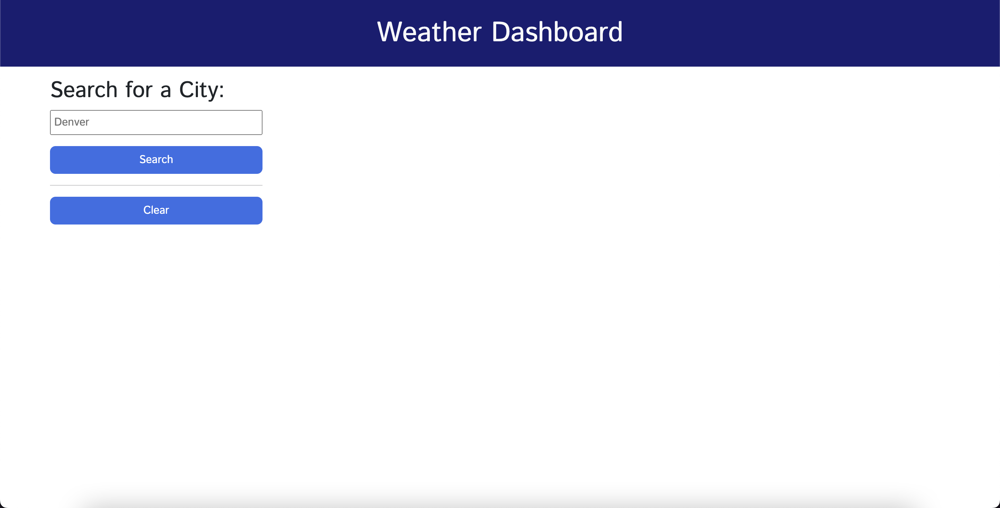

# Challenge 06: Server-Side APIs Weather Dashboard

For this assignment, we had to build a weather dashboard page using the OpenWeatherMap API. I also used the DayJS API for grabbing the current date and formatting. I had to build the HTML, CSS, and Javascript code from scratch. I did utilize styling the page using Bootstrap. We had to have an area to search a city, save the searched city to a search history area, and grab the current and 5-day forecast from the OpenWeatherMap API. Here was the User Story and Acceptance Criteria.

## User Story

```
AS A traveler
I WANT to see the weather outlook for multiple cities
SO THAT I can plan a trip accordingly
```

## Acceptance Criteria

```
GIVEN a weather dashboard with form inputs
WHEN I search for a city
THEN I am presented with current and future conditions for that city and that city is added to the search history
WHEN I view current weather conditions for that city
THEN I am presented with the city name, the date, an icon representation of weather conditions, the temperature, the humidity, and the wind speed
WHEN I view future weather conditions for that city
THEN I am presented with a 5-day forecast that displays the date, an icon representation of weather conditions, the temperature, the wind speed, and the humidity
WHEN I click on a city in the search history
THEN I am again presented with current and future conditions for that city
```

## Screenshots of Application

Landing page

Once a city has been searched

Multiple cities in the search history area


## URL of Deployed Page

https://ashpfander.github.io/weather-dashboard/